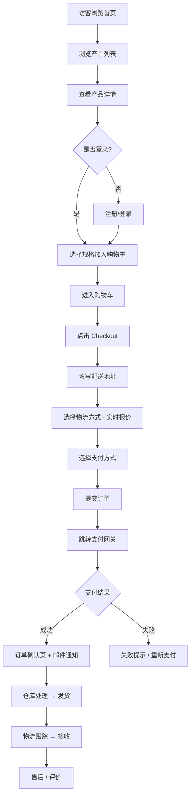
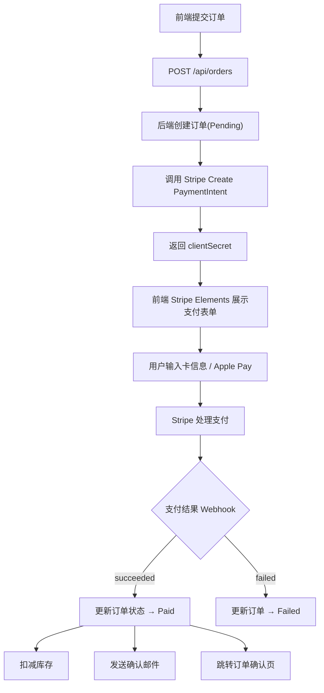
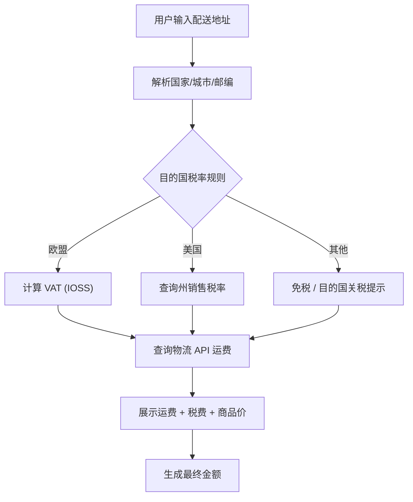

# AXIS O 外贸电商平台 — 全栈规划方案 v2.0

---

## 一、项目概述

基于现有 AXIS O 品牌前端站，升级为完整的 **全栈外贸电商平台**。面向全球市场（欧美为主、东南亚及日韩为辅），以英语为主语言、中文为第二语言，对接 Stripe / PayPal / Alipay Global 三大国际支付通道，实现从商品展示、购物车、下单到支付结算、物流跟踪的全链路闭环。

### 1.1 与 v1.0 的核心差异

| 维度 | v1.0（当前） | v2.0（目标） |
|------|-------------|-------------|
| 架构 | 纯前端 SPA | 前端 + Node.js 后端 + MySQL |
| 数据 | 前端 Mock 数据 | 后端 API + 真实数据库 |
| 用户 | 无需登录 | 注册/登录/权限体系 |
| 支付 | 无 | Stripe + PayPal + Alipay Global |
| 订单 | 无 | 完整订单生命周期 |
| 物流 | 无 | DHL/UPS/FedEx API 对接 |
| 多语言 | 仅中文 | 英文 + 中文双语 |
| 管理 | 无 | 独立 Admin 后台 |
| SEO | CSR | SSR（服务端渲染） |

---

## 二、目标用户与市场

### 2.1 用户画像

| 角色 | 描述 | 核心需求 |
|------|------|----------|
| **国际消费者** | 欧美 25-45 岁女性为主，追求品质与设计感 | 流畅购物、安全支付、透明物流 |
| **海外华人** | 留学生/移民群体，偏好中高端品牌 | 中英双语、支持支付宝 |
| **代购/B端客户** | 小批量批发客户 | 批量折扣、快捷复购 |
| **管理员** | 运营团队 | 产品管理、订单处理、数据分析 |

### 2.2 支持地区

| 区域 | 优先级 | 币种 | 支付偏好 |
|------|--------|------|----------|
| 北美（美国、加拿大） | P0 | USD / CAD | Stripe（信用卡 + Apple Pay）+ PayPal |
| 欧洲（英法德意等） | P0 | EUR / GBP | Stripe + PayPal，需处理 VAT（IOSS）|
| 亚太（日韩、东南亚） | P1 | JPY / KRW / SGD | Stripe + Alipay Global |
| 澳新 | P1 | AUD / NZD | Stripe + PayPal |
| 中国 | P1 | CNY | Alipay Global |

---

## 三、技术栈

### 3.1 前端

| 技术 | 版本 | 用途 |
|------|------|------|
| React | 18.x | UI 框架 |
| TypeScript | 5.x | 类型安全 |
| Vite | 6.x | 构建工具 + 开发服务器 |
| Tailwind CSS | 3.x | 样式系统 |
| React Router | v6 | 客户端路由 |
| Zustand | 5.x | 前端状态管理 |
| i18next | - | 国际化（中英双语） |
| React Query (TanStack) | v5 | 服务端状态管理/缓存 |
| React Hook Form + Zod | - | 表单验证 |
| Lucide React | 0.x | 图标库 |

### 3.2 后端

| 技术 | 版本 | 用途 |
|------|------|------|
| Node.js | 20 LTS | 运行时 |
| Express.js | 4.x | Web 框架 |
| TypeScript | 5.x | 类型安全 |
| MySQL | 8.0 | 主数据库 |
| MySQL2 | 3.x | 数据库驱动 |
| Drizzle ORM | - | 类型安全 ORM + 迁移管理 |
| JWT (jsonwebtoken) | - | 认证 |
| bcryptjs | - | 密码哈希 |
| Stripe SDK | latest | Stripe 支付 |
| @paypal/checkout-server-sdk | - | PayPal 支付 |
| Alipay-SDK (Node.js) | - | 支付宝国际版 |
| Nodemailer / SendGrid | - | 邮件通知 |
| i18next (Node) | - | 服务端国际化 |
| Sharp | - | 图片处理 |
| Express Rate Limit | - | API 限流 |
| Helmet | - | 安全头 |
| CORS | - | 跨域 |
| Winston | - | 日志 |
| Zod | - | 请求验证 |

### 3.3 基础设施

| 服务 | 用途 |
|------|------|
| Redis | Session 缓存 + 限流计数器 + 购物车持久化 |
| MinIO / AWS S3 | 产品图片/静态资源存储 |
| Cloudflare | CDN + DNS + DDoS 防护 |
| Docker | 容器化部署 |
| Nginx | 反向代理 + SSL 终止 |
| PM2 | Node.js 进程管理 |
| GitHub Actions | CI/CD |

---

## 四、项目目录结构

```
axis-o/
├── client/                          # 前端应用
│   └── src/
│       ├── components/              # 组件
│       │   ├── ui/                  # 基础 UI (Button, Input, Modal, Toast...)
│       │   ├── layout/              # 布局 (Navbar, Footer, Sidebar...)
│       │   ├── home/                # 首页模块
│       │   ├── products/            # 产品模块
│       │   ├── cart/                # 购物车模块
│       │   ├── checkout/            # 结账模块 (NEW)
│       │   ├── account/             # 用户中心 (NEW)
│       │   └── order/               # 订单组件 (NEW)
│       ├── pages/
│       │   ├── HomePage.tsx
│       │   ├── ProductListPage.tsx
│       │   ├── ProductDetailPage.tsx
│       │   ├── CartPage.tsx
│       │   ├── CheckoutPage.tsx     # NEW
│       │   ├── OrderConfirmPage.tsx # NEW
│       │   ├── AccountPage.tsx      # NEW
│       │   ├── OrderHistoryPage.tsx # NEW
│       │   ├── OrderDetailPage.tsx  # NEW
│       │   ├── LoginPage.tsx        # NEW
│       │   ├── RegisterPage.tsx     # NEW
│       │   ├── AboutPage.tsx
│       │   └── NotFoundPage.tsx     # NEW
│       ├── hooks/                   # 自定义 Hook
│       ├── store/                   # Zustand Store
│       ├── lib/                     # 工具函数
│       ├── i18n/                    # 国际化 (NEW)
│       │   ├── locales/
│       │   │   ├── en.json
│       │   │   └── zh.json
│       │   └── index.ts
│       ├── types/
│       ├── App.tsx
│       ├── main.tsx
│       └── index.css
│
├── server/                          # 后端应用
│   ├── src/
│   │   ├── index.ts                 # 入口
│   │   ├── app.ts                   # Express 配置
│   │   ├── config/                  # 配置
│   │   │   ├── env.ts               # 环境变量
│   │   │   ├── database.ts          # DB 连接
│   │   │   └── cors.ts
│   │   ├── db/                      # 数据库
│   │   │   ├── schema/              # Drizzle Schema 表定义
│   │   │   │   ├── users.ts
│   │   │   │   ├── products.ts
│   │   │   │   ├── orders.ts
│   │   │   │   ├── payments.ts
│   │   │   │   ├── cart.ts
│   │   │   │   └── ...
│   │   │   ├── migrations/          # 迁移文件
│   │   │   └── seed/                # 种子数据
│   │   ├── middleware/              # 中间件
│   │   │   ├── auth.ts              # JWT 认证
│   │   │   ├── validate.ts          # Zod 校验
│   │   │   ├── rateLimiter.ts       # 限流
│   │   │   ├── errorHandler.ts      # 统一错误处理
│   │   │   └── i18n.ts
│   │   ├── routes/                  # 路由
│   │   │   ├── index.ts
│   │   │   ├── auth.routes.ts
│   │   │   ├── product.routes.ts
│   │   │   ├── cart.routes.ts
│   │   │   ├── order.routes.ts
│   │   │   ├── payment.routes.ts
│   │   │   ├── shipping.routes.ts
│   │   │   ├── user.routes.ts
│   │   │   └── admin.routes.ts      # 管理后台 API
│   │   ├── controllers/             # 控制器
│   │   ├── services/                # 业务逻辑层
│   │   │   ├── auth.service.ts
│   │   │   ├── product.service.ts
│   │   │   ├── cart.service.ts
│   │   │   ├── order.service.ts
│   │   │   ├── payment/             # 支付服务
│   │   │   │   ├── stripe.service.ts
│   │   │   │   ├── paypal.service.ts
│   │   │   │   └── alipay.service.ts
│   │   │   ├── shipping.service.ts
│   │   │   ├── email.service.ts
│   │   │   └── currency.service.ts
│   │   ├── utils/                   # 工具
│   │   │   ├── jwt.ts
│   │   │   ├── password.ts
│   │   │   └── i18n.ts
│   │   └── types/                   # 类型定义
│   ├── package.json
│   └── tsconfig.json
│
├── admin/                           # 管理后台 (NEW)
│   └── src/
│       ├── pages/
│       │   ├── Dashboard.tsx
│       │   ├── ProductsManager.tsx
│       │   ├── OrdersManager.tsx
│       │   ├── CustomersManager.tsx
│       │   ├── DiscountsManager.tsx
│       │   └── Settings.tsx
│       └── ...
│
├── shared/                          # 前后端共享类型 (NEW)
│   └── types/
│       ├── product.ts
│       ├── order.ts
│       ├── user.ts
│       └── api.ts
│
├── docker/
│   ├── Dockerfile.client
│   ├── Dockerfile.server
│   ├── Dockerfile.admin
│   └── docker-compose.yml
│
├── .github/
│   └── workflows/
│       ├── ci.yml
│       └── deploy.yml
│
├── package.json
├── pnpm-workspace.yaml
└── .env.example
```

---

## 五、核心业务流程

### 5.1 完整购物流程



### 5.2 支付流程（Stripe 为例）



### 5.3 物流运费计算流程



---

## 六、数据库模型

### 6.1 ER 图

```mermaid
erDiagram
    users ||--o{ addresses : has
    users ||--o{ orders : places
    users ||--o{ cart_items : has
    users ||--o{ reviews : writes
    users ||--o{ wishlist_items : saves
    users ||--o{ password_resets : requests
    
    products ||--o{ product_images : has
    products ||--o{ product_variants : has
    products ||--o{ cart_items : appears_in
    products ||--o{ order_items : appears_in
    products ||--o{ reviews : receives
    products ||--o{ wishlist_items : appears_in
    products }o--|| categories : belongs_to
    
    orders ||--o{ order_items : contains
    orders ||--o{ payments : has
    orders ||--o{ shipments : has
    orders }o--|| addresses : shipping_to
    orders }o--|| addresses : billing_to
    
    discount_codes ||--o{ orders : applied_to

    users {
        string id PK
        string email UK
        string password_hash
        string first_name
        string last_name
        string phone
        string avatar_url
        enum role "customer, admin"
        enum status "active, inactive, banned"
        string preferred_language
        string preferred_currency
        datetime created_at
        datetime updated_at
    }

    products {
        string id PK
        string name_en
        string name_zh
        string slug UK
        string description_en
        string description_zh
        string story_en
        string story_zh
        string category_id FK
        string series "classic, luxe, travel"
        string material
        decimal base_price
        boolean is_bestseller
        boolean is_active
        int sort_order
        string meta_title
        string meta_description
        datetime created_at
        datetime updated_at
    }

    product_variants {
        string id PK
        string product_id FK
        string color_name
        string color_hex
        string size
        string sku UK
        decimal price_adjustment
        int stock_quantity
        int low_stock_threshold
    }

    product_images {
        string id PK
        string product_id FK
        string url
        string alt_text
        int sort_order
        boolean is_primary
    }

    categories {
        string id PK
        string name_en
        string name_zh
        string slug UK
        string parent_id FK
        int sort_order
    }

    orders {
        string id PK
        string order_number UK
        string user_id FK
        string shipping_address_id FK
        string billing_address_id FK
        string discount_code_id FK
        enum status "pending, paid, processing, shipped, delivered, cancelled, refunded"
        string currency
        decimal subtotal
        decimal shipping_cost
        decimal tax_amount
        decimal discount_amount
        decimal total
        string notes
        string ip_address
        string user_agent
        datetime created_at
        datetime updated_at
    }

    order_items {
        string id PK
        string order_id FK
        string product_id FK
        string variant_id FK
        string product_name
        string variant_description
        int quantity
        decimal unit_price
        decimal total_price
    }

    payments {
        string id PK
        string order_id FK
        enum provider "stripe, paypal, alipay"
        string transaction_id
        enum status "pending, processing, succeeded, failed, refunded"
        decimal amount
        string currency
        json metadata
        datetime created_at
    }

    shipments {
        string id PK
        string order_id FK
        enum carrier "dhl, ups, fedex, other"
        string tracking_number
        enum status "pending, label_created, in_transit, out_for_delivery, delivered, exception"
        decimal weight
        string package_dimensions
        datetime estimated_delivery
        datetime shipped_at
        datetime delivered_at
    }

    addresses {
        string id PK
        string user_id FK
        enum type "shipping, billing"
        string first_name
        string last_name
        string line1
        string line2
        string city
        string state
        string postal_code
        string country
        string phone
        boolean is_default
    }

    cart_items {
        string id PK
        string user_id FK
        string product_id FK
        string variant_id FK
        int quantity
        datetime created_at
    }

    discount_codes {
        string id PK
        string code UK
        enum type "percentage, fixed_amount"
        decimal value
        decimal min_order_amount
        int max_uses
        int current_uses
        datetime valid_from
        datetime valid_until
        boolean is_active
    }

    reviews {
        string id PK
        string user_id FK
        string product_id FK
        int rating
        string title
        string content
        enum status "pending, approved, rejected"
        datetime created_at
    }

    wishlist_items {
        string id PK
        string user_id FK
        string product_id FK
        datetime created_at
    }

    password_resets {
        string id PK
        string user_id FK
        string token UK
        datetime expires_at
        boolean used
    }
```



---

## 七、API 接口设计

### 7.1 接口总览

| 模块 | 前缀 | 认证 | 描述 |
|------|------|------|------|
| 认证 | `/api/auth` | 部分 | 注册/登录/密码重置 |
| 用户 | `/api/users` | 必须 | 个人信息/地址管理 |
| 产品 | `/api/products` | 公开 | 产品 CRUD/搜索/筛选 |
| 购物车 | `/api/cart` | 必须 | 添加/修改/删除 |
| 订单 | `/api/orders` | 必须 | 创建/查看/取消 |
| 支付 | `/api/payments` | 必须 | 创建支付/Webhook |
| 物流 | `/api/shipping` | 公开/必须 | 运费计算/跟踪查询 |
| 管理 | `/api/admin/*` | 管理员 | 后台管理全套 API |
| 货币 | `/api/currency` | 公开 | 汇率查询/转换 |

### 7.2 核心接口示例

```typescript
// === 产品 ===
GET    /api/products?page=1&limit=12&series=classic&sort=price_asc&lang=en
GET    /api/products/:slug
GET    /api/products/bestsellers?limit=8

// === 认证 ===
POST   /api/auth/register        { email, password, firstName, lastName }
POST   /api/auth/login            { email, password }
POST   /api/auth/refresh          { refreshToken }
POST   /api/auth/forgot-password  { email }
POST   /api/auth/reset-password   { token, newPassword }

// === 购物车 ===
GET    /api/cart
POST   /api/cart/items            { variantId, quantity }
PATCH  /api/cart/items/:id        { quantity }
DELETE /api/cart/items/:id

// === 订单 ===
POST   /api/orders                { shippingAddressId, billingAddressId, shippingMethod, paymentMethod, discountCode?, notes? }
GET    /api/orders
GET    /api/orders/:id
POST   /api/orders/:id/cancel

// === 支付 ===
POST   /api/payments/create-intent  { orderId, provider: "stripe"|"paypal"|"alipay" }
POST   /api/payments/webhook/stripe
POST   /api/payments/webhook/paypal
POST   /api/payments/webhook/alipay

// === 物流 ===
GET    /api/shipping/rates         { country, city, postalCode, weight, dimensions[] }
GET    /api/shipping/track/:trackingNumber

// === 货币 ===
GET    /api/currency/rates         { base: "USD" }
POST   /api/currency/convert       { from: "USD", to: "EUR", amount: 100 }
```

### 7.3 统一响应格式

```typescript
interface ApiResponse<T> {
  success: boolean
  data?: T
  error?: {
    code: string
    message: string       // 根据 Accept-Language 返回对应语言
    details?: unknown
  }
  pagination?: {
    page: number
    limit: number
    total: number
    totalPages: number
  }
}
```

---

## 八、支付方案详情

### 8.1 支付通道对比

| 特性 | Stripe | PayPal | Alipay Global |
|------|--------|--------|---------------|
| 覆盖地区 | 全球 46 国 | 全球 200+ 国 | 支付宝覆盖地区 |
| 支持卡种 | Visa/MC/Amex/UnionPay | Visa/MC/Amex | 支付宝余额/绑定卡 |
| 本地钱包 | Apple Pay / Google Pay | Venmo (美国) | 支付宝 |
| 结算币种 | 135+ 币种 | 25 币种 | 18 币种 |
| 手续费 (国际) | 3.9% + 固定费用 | 4.4% + 固定费用 | 2.2% - 3.0% |
| API 文档质量 | ⭐⭐⭐⭐⭐ | ⭐⭐⭐⭐ | ⭐⭐⭐ |
| 沙箱环境 | ✅ | ✅ | ✅ |
| Webhook | ✅ 完善 | ✅ 完善 | ✅ |

### 8.2 支付策略路由

```
用户选择国家/币种 → 推荐支付方式：
├── 美国/加拿大 → Stripe (default) + PayPal + Apple Pay
├── 欧洲       → Stripe (default) + PayPal + SEPA
├── 英国       → Stripe (default) + PayPal
├── 日韩       → Stripe (default) + Alipay Global
├── 东南亚     → Stripe (default) + Alipay Global
├── 澳新       → Stripe (default) + PayPal
└── 中国       → Alipay Global (default) + WeChat Pay
```

### 8.3 支付安全

- PCI DSS Level 1 合规（通过 Stripe/PayPal 令牌化处理，不存储卡信息）
- 3D Secure 2.0 强制启用
- IP 风控：单 IP 24h 内支付尝试次数限制
- 金额风控：单笔超过 $500 触发人工审核
- Webhook 签名验证（防伪造回调）
- 幂等键（Idempotency Key）防重复扣款

---

## 九、国际物流方案

### 9.1 物流商对接

| 物流商 | API | 覆盖 | 时效 | 适用场景 |
|--------|-----|------|------|----------|
| DHL Express | ✅ | 全球 220+ | 3-5 工作日 | 首选，品牌高端定位 |
| FedEx | ✅ | 全球 220+ | 3-7 工作日 | 美洲优选 |
| UPS | ✅ | 全球 220+ | 3-7 工作日 | 备选方案 |
| EMS/ePacket | ❌ | 全球 | 7-20 工作日 | 低价选项（不做 API） |

### 9.2 运费计算策略

- 实时调用 DHL/FedEx API 获取报价
- 按包裹重量 + 体积重 + 目的国计算
- 满 $300（或等值）全球免运费
- 低于门槛展示阶梯式运费（$15 / $25 / $40 三档）

### 9.3 税费处理

- **欧盟 VAT**：注册 IOSS，订单 ≤€150 在结账时收取 VAT 并代缴
- **美国 Sales Tax**：对接 TaxJar / Avalara API 自动计算各州税率
- **英国 VAT**：£135 以下在销售点收取，以上由海关收取
- **其他国家**：提示"关税由收件人承担"免责声明

---

## 十、多语言与国际化

### 10.1 语言范围

| 语言 | 代码 | 覆盖内容 |
|------|------|----------|
| 英语 | en | 默认语言，完整覆盖全部页面 + API 消息 + 邮件模板 |
| 中文 | zh | 完整覆盖全部页面 + API 消息 + 邮件模板 |

### 10.2 国际化范围

- **前端 UI**：所有页面文案（i18next + react-i18next）
- **产品数据**：name_en/name_zh、description_en/description_zh
- **API 错误消息**：根据请求头 `Accept-Language` 返回对应语言
- **邮件模板**：根据用户 `preferred_language` 发送对应语言版本
- **SEO**：hreflang 标签、多语言 sitemap、本地化 meta 信息
- **货币**：根据 IP/用户设置自动切换显示货币（USD/EUR/GBP 等）
- **日期/时间/数字格式**：Intl API 本地化

### 10.3 语言切换

- 顶部导航栏提供 EN / 中文 切换按钮
- 语言偏好存储在 localStorage + 用户账户中
- 首次访问根据浏览器 `navigator.language` 自动匹配

---

## 十一、SEO 策略

### 11.1 SSR 渲染

- 使用 Vite SSR 或 Astro 框架实现服务端渲染
- 或者保留 React SPA 架构 + 预渲染关键页面实现 SEO
- 产品详情页、系列页、关于页必须 SSR
- 购物车/结账/账户页保持 CSR

### 11.2 SEO 要素

| 要素 | 实现 |
|------|------|
| Meta Title/Description | 每页面独立，产品页动态生成，中英双语 |
| Open Graph | 产品分享卡片优化 |
| Structured Data | Product/Organization/BreadcrumbList JSON-LD |
| Sitemap | 多语言 sitemap.xml，自动生成并提交 |
| Canonical URL | 防止多语言重复内容 |
| hreflang | 中英文页面互相标注 |
| URL 结构 | `/products/classic-tote` (SEO友好 slug) |
| 图片 alt | 中英双语 alt 文本 |
| Core Web Vitals | LCP < 2.5s, FID < 100ms, CLS < 0.1 |

---

## 十二、管理后台

### 12.1 功能模块

| 模块 | 功能 |
|------|------|
| Dashboard | 今日订单/收入/访客概览、图表 |
| 产品管理 | CRUD、批量导入/导出、库存管理、图片管理 |
| 订单管理 | 列表筛选、状态流转（确认→发货→完成）、退款处理 |
| 客户管理 | 客户列表、详情、订单历史、标签 |
| 优惠管理 | 优惠码创建/管理、满减规则、生效时间 |
| 内容管理 | Banner管理、首页推荐配置、关于页编辑 |
| 设置 | 运费规则、税费配置、支付配置、多语言管理 |
| 报表 | 销售报表、产品销量排行、地区分布 |

### 12.2 权限体系

| 角色 | 权限范围 |
|------|----------|
| Super Admin | 全部权限 + 管理员账号管理 |
| Admin | 产品/订单/客户管理、报表查看 |
| Editor | 产品内容编辑、内容管理 |
| Viewer | 只读查看 |

---

## 十三、安全方案

| 维度 | 措施 |
|------|------|
| 传输安全 | 全站 HTTPS (TLS 1.3)，HSTS 头 |
| 认证 | JWT (Access 15min + Refresh 7d)，bcrypt 哈希 |
| API 安全 | Rate Limiting (100 req/min per IP)，CORS 白名单，Helmet |
| 支付安全 | PCI DSS 合规（Stripe/PayPal 代处理），Webhook 签名验证 |
| 数据安全 | 敏感字段加密，数据库连接 SSL，定期备份 |
| 输入安全 | Zod 校验所有输入，SQL 注入防护（参数化查询），XSS 过滤 |
| CSRF | SameSite Cookie + CSRF Token |
| 日志 | Winston 记录所有 API 请求/错误/支付事件 |
| DDoS | Cloudflare 代理 + Rate Limiting |

---

## 十四、里程碑计划

### Phase 1: 基础架构搭建（Week 1-2）
- [ ] 搭建 monorepo 项目结构（pnpm workspace）
- [ ] 初始化 Express + TypeScript 后端
- [ ] MySQL 数据库设计与 Drizzle ORM 迁移
- [ ] 用户认证系统（注册/登录/JWT）
- [ ] 基础中间件（CORS/Helmet/RateLimit/ErrorHandler）
- [ ] 统一 API 响应格式与错误码

### Phase 2: 核心业务（Week 3-4）
- [ ] 产品 API（CRUD/搜索/筛选/分页）
- [ ] 购物车 API（与用户绑定）
- [ ] 订单 API（创建/查询/状态流转）
- [ ] 前端对接产品 API（替换 Mock 数据）
- [ ] 地址管理 API
- [ ] 国际化基础设施（i18next 前后端配置）

### Phase 3: 支付与物流（Week 5-6）
- [ ] Stripe 支付集成（PaymentIntent + Webhook）
- [ ] PayPal 支付集成
- [ ] Alipay Global 支付集成
- [ ] 统一支付网关抽象层
- [ ] DHL/FedEx 物流 API 对接
- [ ] 运费实时计算
- [ ] 税费计算（TaxJar 对接）

### Phase 4: 前端完善（Week 7-8）
- [ ] 结账流程页面（地址 → 物流 → 支付 → 确认）
- [ ] 用户中心（订单历史/地址管理/个人信息）
- [ ] 中英双语完整覆盖
- [ ] 多币种切换
- [ ] SEO 优化（Meta/Sitemap/Structured Data）

### Phase 5: 管理后台（Week 9-10）
- [ ] Admin 登录与权限控制
- [ ] Dashboard 概览
- [ ] 产品/订单/客户管理页面
- [ ] 优惠码管理
- [ ] 报表导出

### Phase 6: 上线准备（Week 11-12）
- [ ] 性能优化（CDN/缓存/图片优化）
- [ ] 安全审计
- [ ] 压力测试
- [ ] Docker 容器化部署
- [ ] CI/CD 流水线
- [ ] 监控告警（Sentry + Uptime）
- [ ] 文档编写（API 文档/运维手册）

---

## 十五、成功指标

| 指标 | 目标 | 测量方式 |
|------|------|----------|
| 页面加载速度 | LCP < 2.5s（全球 CDN） | Lighthouse + Web Vitals |
| API 响应时间 | P95 < 500ms | APM 监控 |
| 支付成功率 | > 95% | Stripe/PayPal Dashboard |
| 购物车转化率 | > 3%（从添加购物车到下单） | Google Analytics |
| 订单到发货时间 | < 48 小时 | 内部运营 KPI |
| SEO 收录 | 核心页面 Google 索引覆盖率 > 80% | Google Search Console |
| 多语言覆盖率 | 前端/API/邮件 100% 中英双语 | 人工审核 |
| 系统可用性 | > 99.9%（排除计划维护） | Uptime 监控 |
| 移动端适配 | 全部页面响应式，移动端加载 < 3s | Lighthouse Mobile |

---

## 十六、开问题项

| 编号 | 问题 | 优先级 | 建议方案 |
|------|------|--------|----------|
| Q1 | 是否需要 CMS（Strapi/Sanity）代替自建产品管理？ | P2 | 建议自建 Admin，保持技术栈统一 |
| Q2 | 是否需要 Wishlist（收藏夹）功能？ | P2 | Phase 2 追加 |
| Q3 | 是否需要 Affiliate（联盟营销）系统？ | P3 | V2.1 考虑 |
| Q4 | 是否对接第三方客服（Zendesk/Intercom）？ | P2 | 上线前评估，初期可用邮件 |
| Q5 | 域名/服务器/支付账户是否已就绪？ | P0 | 需确认 Stripe/PayPal/Alipay 商务账户 |
| Q6 | 是否需要 A/B 测试工具？ | P3 | V2.1 考虑 |

---

## 变更记录

| 版本 | 日期 | 作者 | 变更概要 |
|------|------|------|----------|
| 2.0 | 2026-05-25 | Agent | 从纯前端品牌站升级为全栈外贸电商平台，新增后端/支付/物流/多语言/管理后台全链路方案 |
