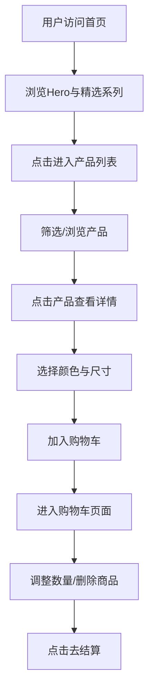

## 1. 产品概述

AXIS O 是一个高端时尚包包品牌官网，面向追求品质与设计感的都市女性。网站以极简美学呈现产品，通过沉浸式的视觉叙事传递品牌"简约而不简单"的设计理念，打造优雅、精致的线上购物体验。

## 2. 核心功能

### 2.1 用户角色

| 角色 | 注册方式 | 核心权限 |
|------|----------|----------|
| 普通访客 | 无需注册 | 浏览产品、查看详情、加入购物车 |
| 会员用户 | 邮箱注册 | 下单购买、查看订单、收藏产品 |

### 2.2 功能模块

1. **首页**: Hero 大图轮播、品牌故事、精选系列、热销产品、材质工艺展示、页脚导航
2. **产品列表页**: 产品分类筛选、产品卡片网格、排序功能
3. **产品详情页**: 产品大图展示、颜色/尺寸选择、加入购物车、产品故事描述
4. **购物车页**: 商品列表、数量调整、价格汇总、结算入口
5. **关于我们页**: 品牌故事、工艺展示、可持续发展理念

### 2.3 页面详情

| 页面名称 | 模块名称 | 功能描述 |
|----------|----------|----------|
| 首页 | 顶部导航栏 | Logo居中，左侧菜单，右侧购物车/用户图标，滚动时固定 |
| 首页 | Hero 区域 | 全屏产品大图，标题文案与CTA按钮，支持自动轮播 |
| 首页 | 精选系列 | 三个系列卡片横向排列，悬浮时图片微缩放，点击跳转列表页 |
| 首页 | 热销产品 | 4列产品卡片网格，显示产品图、名称、价格，悬浮显示快速加入购物车 |
| 首页 | 品牌理念 | 左右图文排版，介绍材质工艺与设计理念 |
| 首页 | 底部导航 | 多列链接、社交媒体图标、版权信息、邮箱订阅 |
| 产品列表页 | 筛选栏 | 按系列、颜色、价格区间筛选，网格/列表视图切换 |
| 产品列表页 | 产品网格 | 3列产品卡片，懒加载，悬浮效果 |
| 产品详情页 | 图片画廊 | 左侧缩略图，右侧大图，支持放大查看 |
| 产品详情页 | 产品信息 | 名称、价格、颜色选择器、尺寸选择、数量、加入购物车按钮 |
| 产品详情页 | 详情描述 | 产品故事、材质说明、尺寸规格、保养建议 |
| 购物车页 | 商品列表 | 产品缩略图、名称、颜色/尺寸、单价、数量调节、删除 |
| 购物车页 | 订单摘要 | 小计、运费估算、总计、结算按钮 |
| 关于我们 | 品牌故事 | 大图+文字交错排版，时间线叙事 |
| 关于我们 | 工艺展示 | 图文展示皮革选材、手工制作过程 |

## 3. 核心流程

用户访问首页 → 浏览 Hero 轮播与精选系列 → 点击产品进入列表页 → 按分类/颜色筛选 → 点击产品进入详情页 → 选择颜色/尺寸 → 加入购物车 → 进入购物车查看 → 调整数量 → 点击结算

## 4. 用户界面设计

### 4.1 设计风格

- **主色调**: 暖米色 #F5F0E8（背景）、深棕色 #3C2415（文字）、焦糖棕 #C89460（强调色）
- **辅助色**: 奶油白 #FAF7F2、橄榄绿 #6B705C（点缀）、陶土色 #C17E60
- **按钮风格**: 简约线条风格，默认透明底+深棕边框，悬浮时填充深棕色+白色文字，带0.3s过渡动画
- **字体**: 标题使用 Playfair Display（衬线体）、正文使用 DM Sans（无衬线体），中文回退使用思源宋体/思源黑体
- **字号层级**: Hero标题 64px、区块标题 40px、卡片标题 20px、正文 16px、辅助文字 14px
- **布局风格**: 大面积留白，非对称排版，图文交错布局，产品卡片网格
- **图标风格**: 使用 Lucide React 线性图标，统一 1.5px 描边

### 4.2 页面设计概述

| 页面名称 | 模块名称 | UI元素 |
|----------|----------|--------|
| 首页 | 导航栏 | 固定顶部，白色半透明毛玻璃背景，Logo居中，菜单项水平排列，购物车图标带数量角标 |
| 首页 | Hero | 全屏轮播，产品大图占满屏幕，标题与CTA按钮位于左下角，淡入动画 |
| 首页 | 精选系列 | 3列不等宽网格，每列一张产品场景图，标题叠加在图片底部，悬浮微缩放+文字上移 |
| 首页 | 热销产品 | 4列网格，白色产品卡片，产品图占80%，下方名称+价格，悬浮显示阴影+快速加购按钮 |
| 首页 | 品牌理念 | 左右分栏，左侧大图，右侧文字+小图标列表，滚动时淡入 |
| 产品列表页 | 筛选栏 | 顶部粘性筛选栏，水平排列下拉框/按钮组，选中状态用焦糖色高亮 |
| 产品详情页 | 图片画廊 | 左侧竖排缩略图列表，右侧大图区，点击缩略图切换大图，支持鼠标悬停放大镜 |
| 产品详情页 | 购买区 | 右侧固定信息栏，滚动时保持可见，包含所有购买选项和CTA |

### 4.3 响应式设计

- 桌面端优先设计（1440px基准），最大宽度1440px居中
- 平板端（768px-1024px）：产品卡片3列→2列，Hero文字缩小
- 移动端（<768px）：导航改为汉堡菜单，产品卡片2列→1列，Hero全屏高度自适应，详情页图片画廊改为横向滑动

## 5. 产品数据

### 5.1 产品系列

| 系列名称 | 定位 | 价格区间 |
|----------|------|----------|
| 经典系列 (Classic) | 日常通勤，简约百搭 | ¥1,280 - ¥2,580 |
| 轻奢系列 (Luxe) | 精致宴会，高级质感 | ¥2,980 - ¥5,880 |
| 旅行系列 (Travel) | 周末出行，实用大容量 | ¥1,680 - ¥3,280 |

### 5.2 产品属性

每个产品包含：名称、系列、描述、价格、颜色列表、尺寸列表、材质、产品图片组、产品故事
