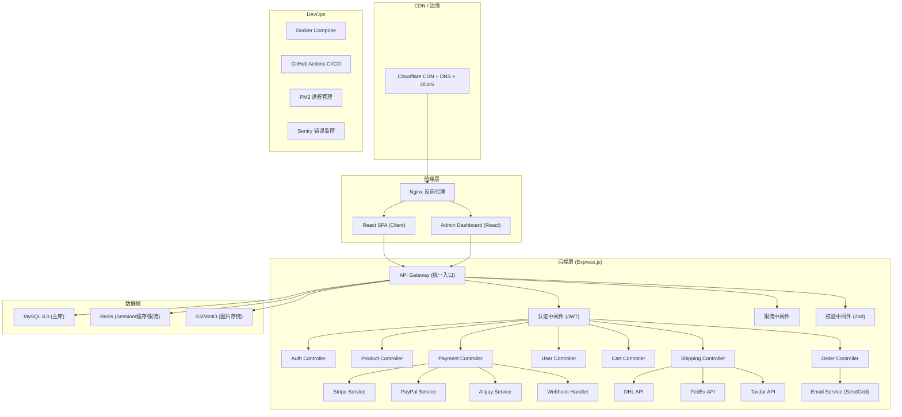

## 1. 架构设计

## 2. 技术选型

| 层级 | 技术 | 版本 | 说明 |
|------|------|------|------|
| 前端框架 | React | 18.x | SPA + 管理后台共用组件 |
| 前端状态 | Zustand + React Query | 5.x / 5.x | 本地状态 + 服务端缓存 |
| 国际化 | i18next + react-i18next | - | 中英双语 |
| 后端框架 | Express.js | 4.x | 轻量灵活 |
| ORM | Drizzle ORM | latest | 类型安全 + 迁移管理 |
| 数据库 | MySQL | 8.0 | 主数据库 |
| 缓存/队列 | Redis | 7.x | Session + 限流 + 缓存 |
| 认证 | JWT + bcryptjs | - | Access/Refresh Token |
| 支付 | Stripe SDK + PayPal SDK | latest | 双通道 |
| 图片处理 | Sharp | latest | 图片压缩/裁剪 |
| 邮件 | @sendgrid/mail | latest | 交易邮件 |
| 部署 | Docker + Nginx + PM2 | - | 容器化 |
| CI/CD | GitHub Actions | - | 自动构建/部署 |
| 监控 | Sentry + PM2 metrics | - | 错误追踪 |

## 3. 路由定义（全栈版）

### 3.1 前端路由

| 路由 | 页面组件 | SSR | 认证 | 说明 |
|------|----------|-----|------|------|
| `/` | HomePage | ✅ | 否 | 首页 |
| `/products` | ProductListPage | ✅ | 否 | 产品列表 |
| `/products/:slug` | ProductDetailPage | ✅ | 否 | 产品详情 |
| `/cart` | CartPage | ❌ | 否 | 购物车 |
| `/checkout` | CheckoutPage | ❌ | 是 | 结账 |
| `/order/:id/confirm` | OrderConfirmPage | ❌ | 是 | 订单确认 |
| `/account` | AccountPage | ❌ | 是 | 用户中心 |
| `/account/orders` | OrderHistoryPage | ❌ | 是 | 订单历史 |
| `/account/orders/:id` | OrderDetailPage | ❌ | 是 | 订单详情 |
| `/login` | LoginPage | ❌ | 否 | 登录 |
| `/register` | RegisterPage | ❌ | 否 | 注册 |
| `/about` | AboutPage | ✅ | 否 | 关于我们 |
| `/admin/*` | Admin Pages | ❌ | 管理员 | 管理后台 |

### 3.2 后端 API 路由

| 方法 | 路由 | 认证 | 说明 |
|------|------|------|------|
| `GET` | `/api/products` | 否 | 产品列表（分页/筛选/排序）|
| `GET` | `/api/products/:slug` | 否 | 产品详情 |
| `GET` | `/api/products/bestsellers` | 否 | 热销产品 |
| `POST` | `/api/auth/register` | 否 | 用户注册 |
| `POST` | `/api/auth/login` | 否 | 用户登录 |
| `POST` | `/api/auth/refresh` | 否 | 刷新令牌 |
| `GET` | `/api/cart` | 是 | 获取购物车 |
| `POST` | `/api/cart/items` | 是 | 添加商品到购物车 |
| `PATCH` | `/api/cart/items/:id` | 是 | 更新购物车项 |
| `DELETE` | `/api/cart/items/:id` | 是 | 删除购物车项 |
| `GET` | `/api/users/me` | 是 | 获取当前用户信息 |
| `PATCH` | `/api/users/me` | 是 | 更新个人信息 |
| `GET` | `/api/users/me/addresses` | 是 | 地址列表 |
| `POST` | `/api/users/me/addresses` | 是 | 添加地址 |
| `POST` | `/api/orders` | 是 | 创建订单 |
| `GET` | `/api/orders` | 是 | 订单列表 |
| `GET` | `/api/orders/:id` | 是 | 订单详情 |
| `POST` | `/api/payments/create-intent` | 是 | 创建支付意向 |
| `POST` | `/api/webhooks/stripe` | Webhook签名 | Stripe 回调 |
| `POST` | `/api/webhooks/paypal` | Webhook签名 | PayPal 回调 |
| `GET` | `/api/shipping/rates` | 否 | 运费报价 |
| `GET` | `/api/shipping/track/:number` | 否 | 物流跟踪 |
| `GET` | `/api/currency/rates` | 否 | 汇率查询 |
| `GET` | `/api/admin/dashboard` | 管理员 | 仪表盘 |
| `GET/POST/PATCH/DELETE` | `/api/admin/products` | 管理员 | 产品管理 |
| `GET/PATCH` | `/api/admin/orders` | 管理员 | 订单管理 |
