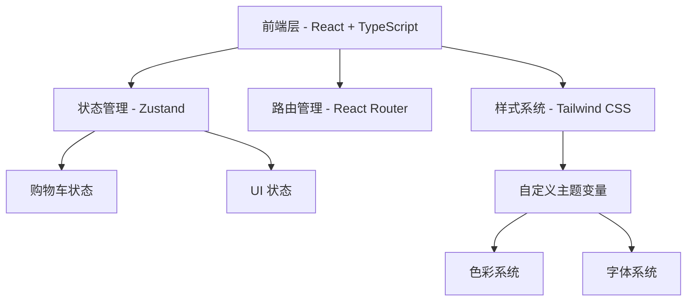

## 1. 架构设计



## 2. 技术选型

- **前端框架**: React@18 + TypeScript
- **构建工具**: Vite
- **样式方案**: Tailwind CSS@3
- **路由**: React Router DOM v6
- **状态管理**: Zustand
- **图标**: Lucide React
- **初始化工具**: vite-init (react-ts 模板)
- **后端**: 无（纯前端项目，使用 Mock 数据）

## 3. 路由定义

| 路由 | 页面 | 说明 |
|------|------|------|
| / | HomePage | 品牌首页，Hero轮播、精选系列、热销产品、品牌理念 |
| /products | ProductListPage | 产品列表，支持分类筛选和排序 |
| /products/:id | ProductDetailPage | 产品详情，图片画廊、规格选择、加入购物车 |
| /cart | CartPage | 购物车，商品管理、价格汇总 |
| /about | AboutPage | 关于我们，品牌故事、工艺展示 |

## 4. 组件树

```
App
├── Layout
│   ├── Navbar (导航栏：Logo、菜单、购物车图标)
│   └── Footer (页脚：链接、社交图标、版权)
├── Pages
│   ├── HomePage
│   │   ├── HeroSection (全屏轮播)
│   │   ├── CollectionSection (精选系列卡片)
│   │   ├── BestSellersSection (热销产品网格)
│   │   └── BrandStorySection (品牌理念图文)
│   ├── ProductListPage
│   │   ├── FilterBar (筛选栏)
│   │   └── ProductGrid (产品网格)
│   ├── ProductDetailPage
│   │   ├── ImageGallery (图片画廊)
│   │   ├── ProductInfo (产品信息与购买)
│   │   └── ProductDescription (详情描述)
│   ├── CartPage
│   │   ├── CartItemList (购物车列表)
│   │   └── OrderSummary (订单摘要)
│   └── AboutPage
│       ├── StoryTimeline (品牌时间线)
│       └── Craftsmanship (工艺展示)
└── Shared Components
    ├── ProductCard (产品卡片)
    ├── Button (通用按钮)
    └── Badge (角标)
```

## 5. 数据模型

### 5.1 Mock 数据结构

```typescript
interface Product {
  id: string;
  name: string;
  series: 'classic' | 'luxe' | 'travel';
  description: string;
  price: number;
  colors: ProductColor[];
  sizes: string[];
  material: string;
  images: string[];
  story: string;
  isBestSeller: boolean;
}

interface ProductColor {
  name: string;
  hex: string;
  imageIndex: number;
}

interface CartItem {
  productId: string;
  colorName: string;
  size: string;
  quantity: number;
}
```

### 5.2 Zustand Store

```typescript
interface CartStore {
  items: CartItem[];
  addItem: (item: CartItem) => void;
  removeItem: (productId: string, colorName: string, size: string) => void;
  updateQuantity: (productId: string, colorName: string, size: string, quantity: number) => void;
  clearCart: () => void;
  totalItems: () => number;
  totalPrice: (products: Product[]) => number;
}
```

## 6. 目录结构

```
src/
├── components/
│   ├── layout/
│   │   ├── Navbar.tsx
│   │   └── Footer.tsx
│   ├── home/
│   │   ├── HeroSection.tsx
│   │   ├── CollectionSection.tsx
│   │   ├── BestSellersSection.tsx
│   │   └── BrandStorySection.tsx
│   ├── products/
│   │   ├── ProductCard.tsx
│   │   ├── ProductGrid.tsx
│   │   ├── FilterBar.tsx
│   │   ├── ImageGallery.tsx
│   │   ├── ProductInfo.tsx
│   │   └── ProductDescription.tsx
│   ├── cart/
│   │   ├── CartItemList.tsx
│   │   └── OrderSummary.tsx
│   └── ui/
│       ├── Button.tsx
│       └── Badge.tsx
├── pages/
│   ├── HomePage.tsx
│   ├── ProductListPage.tsx
│   ├── ProductDetailPage.tsx
│   ├── CartPage.tsx
│   └── AboutPage.tsx
├── store/
│   └── cartStore.ts
├── data/
│   └── products.ts
├── types/
│   └── index.ts
├── App.tsx
├── main.tsx
└── index.css
```
